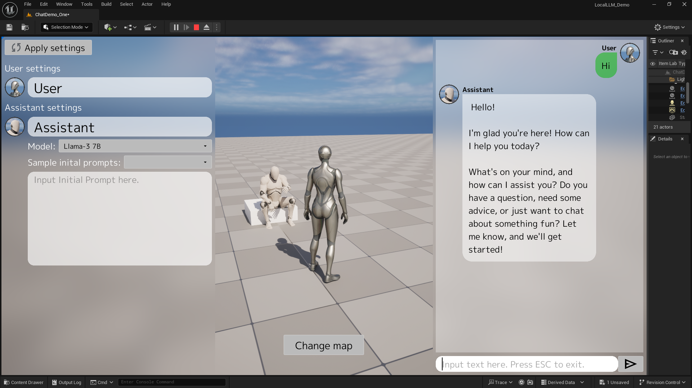

# Chat demo

{ loading=lazy }  

## Download

Packaged build in EXE format is available [here](https://github.com/Akiya-Research-Institute/LocalLLM-Demo-UE5/releases)

## GitHub source

UE5 project files are available at [GitHub](https://github.com/Akiya-Research-Institute/LocalLLM-Demo-UE5)

## Software Requirements

- Windows 64bit
- Unreal Engine 5.4.2
- Local LLM plugin v1.0 or above

(Optinal) if you want to run with a GPU,

- CUDA: 12.2.0

## Hardware Reauirements

- A CPU that supports AVX, AVX2 and FMA.  

    The following CPUs should work.

    - Intel: 4th Generation (Haswell) and above
    - AMD: All Ryzen series

(Optinal) if you want to run with a GPU,

- A NVIDIA GPU that supports CUDA 12.2.0

## How to use this demo
Demo project contains 2 maps.

- /Content/LocalLLMDemo/Map/ChatDemo_One  
  Demonstration of conversation with 1 NPC

- /Content/LocalLLMDemo/Map/ChatDemo_Multi  
  Demonstration of conversation with 2 NPCs

When you get close to the characters, a dialog UI automatically appears.
