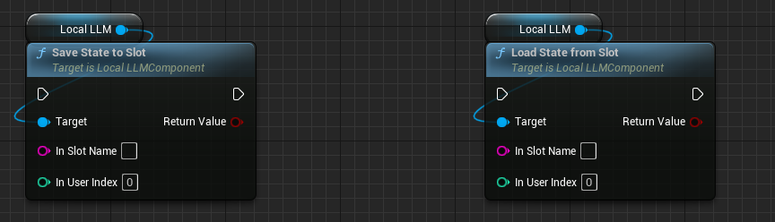
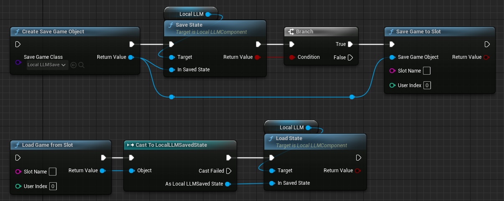

# State save and load

You can save and load “states” that hold the current settings and conversation history.

## Save to / Load from Asset

{ loading=lazy }  

- Call `SaveStateToAsset` function to save the state asset to the specified path.
- Call `LoadState` function to load the state from the specified asset. All the current settings and conversation history are discarded. The model is re-initialized with the loaded settings and the conversation history.

## Save to / Load from Slot

{ loading=lazy }  

As in the usual `Save Game`, state can be saved to a slot specified by the `Slot Name` and `User Index`.

- Call `SaveStateToSlot` function to save the state to the specified slot.
- Call `LoadStateFromSlot` function to load the state from the specified slot. All the current settings and conversation history are discarded. The model is re-initialized with the loaded settings and the conversation history.

??? Tip "Use `Save Game` objects directly"

	{ loading=lazy }  
	
	To use `Save Game` objects directly with `Create Save Game Object` or `Load Game from Slot`, you can save and load state as described above using the following two functions.

	- `Save State` function: Writes state to the specified `LocalLLMSaveState` object.
	- `Load State` function: Read state from the specified `LocalLLMSaveState` object.

## Initialize from state saves

{ loading=lazy }  

To initialize the LLM with saved states, select the `Local LLM` component and make the following settings in the `Local LLM > Initialization Method` in the Details tab.

- `Initialization Method = Saved State`: Use to initialize by loading a saved state from an asset. Specify asset to load by `Saved State`.
- `Initialization Method = Saved State from Slot`: Use to initialize by loading a saved state from a slot. Specify the slot to load by `Slot Name` and `User Index`.

Especially if the `Initial Prompt` and `Talk History` are long, loading the saved state will initialize the LLM faster than initializing the LLM in the usual way.