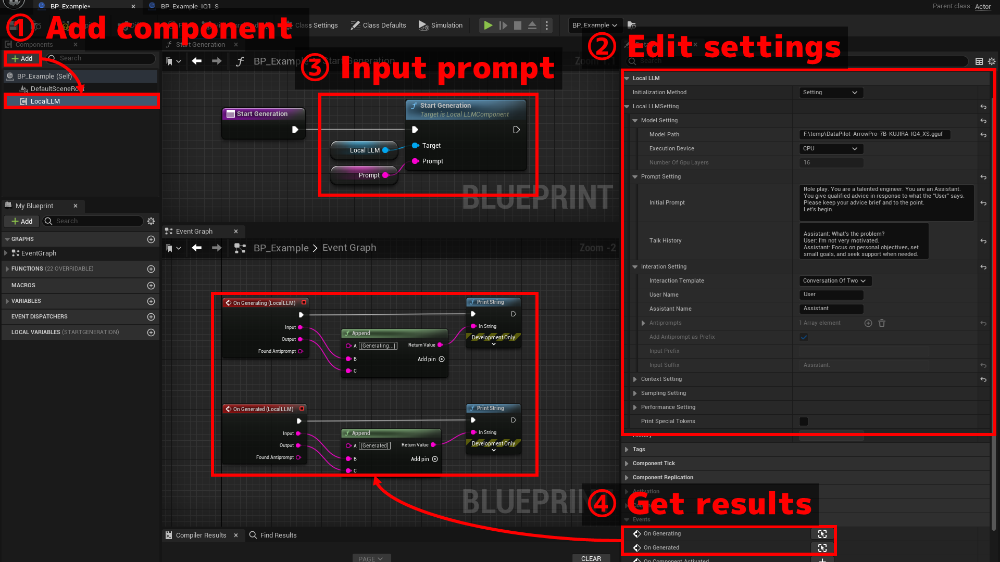

# Basic usage

See `Plugins > LocalLLM > BP > BP_LocalLLM_Example` for a sample implementation.  
You can test it in sample maps located at `Plugins > LocalLLM > Map`.

{ loading=lazy }  

## 1. Add a component

1. Create an actor blueprint.
2. Add `Local LLM` component.

## 2. Edit settings

Select the `Local LLM` component and edit the following settings at `Local LLM > Local LLM Setting` in the Details tab.

1. Model Setting

	- `Path Type`: The path type of the model. Whether absolute path or relative to the project directories.
	- `Model Path`: Specify the path to the gguf model.
	- `Execution device`: Whether to use CPU or GPU.
	- `Number Of Gpu Layers`: If using a GPU, specify the number of layers in the model to be run on the GPU.
	- `LoRA Settings`: Specify LoRA file path and strength if using LoRA.

2. Prompt Setting

	- `Initial Prompt`: Describe the role of the LLM and basic instructions.  
	- `Talk History`: Describe the history of the conversation so far. This is used when you want to resume a previous conversation without using the state save/load described in the next page.

	Both of these are "the first prompt entered into the LLM" when the LLM is initialized.  
	The difference is that the `Initial Prompt` is retained throughout the conversation (in the default setting), while the `Talk History` can be discarded if the conversation becomes too long.  
	This is because there is a limit to the length of the string (context length) that can be entered into the LLM. How information is retained and discarded is set in the `Context Setting` described later.

	??? Tip "Example of Initial Prompt"

		Role play. You are a talented engineer. You speak as an "Assistant". You give appropriate advice in response to the statement of "User". Your advice should be brief and to the point. An example of a conversation is shown below.

		(Example)  
		User: I'm getting an error message and the compile fails.  
		Assistant: Read the error message first. Most things can be solved with that.  
		User: I have no idea what it's saying!  
		Assistant: Then Google the error message. You may be able to find a solution in the forum.  
		User: OK!  
		Assistant: It is also important to read the manual, if there is one!

		Let's get started.

3. Interaction Setting

	Set how to process prompts for chat-like experience with LLMs. Templates for common settings can be selected at `Interaction Template`.

	- `Interaction Template = Interaction of Two`: Automatically configures the settings for the conversation between two people, the User and the Assistant. The names of the User and AI Assistant must be set, and these must match the conversation examples, if any, described in the `Prompt Setting`.
	- `Interaction Template = Instruction`: Configures the settings for Instruction format. Used for Alpaca models, etc.
	- `Interaction Template = ChatML`: Configures the settings for ChatML format. Used for models trained with ChatML syntax.

	??? Tip "Manual settings without templates"

		If `Interaction Template = None`, set the following values manually.

		- `Antiprompts`: When LLM outputs one of these phrases, it stops to generate text. For example, "User:" can be used to stop generation when it's the user's turn to speak. Also known as Reverse prompts or Stop keywords.
		- `Add Antiprompt as Prefix`: Whether to add the first one of `Antiprompts` automaticcaly to the next prompt as prefix after LLM stops without antiprompt (for example, after <End Of Sequence> token is generated). For example, when antiprompts = { "User:" } and  LLM stopped with EOS, "User:" will be automatically added to the next prompt.
		- `Antiprompt_prefix`: Prefix for antiprompt when bAddAntipromptAsPrefix = true and LLM stopped without an antiprompt. For example, "\n" can be used to add a line break before "User:" added to the next prompt.
		- `Antiprompt_suffix`: Prefix for antiprompt when bAddAntipromptAsPrefix = true and LLM stopped without an antiprompt. For example, " " can be used to add a space after "User:" added to the next prompt.
		- `Input Prefix`: Prefix immediately before the user's input.
		- `Input Suffix`: Suffix immediately after user's input. This is useful for adding an "Assistant:" prompt after the user's input. It's added after the new-line character (\n) that's automatically added to the end of the user's input.
		
4. Context Setting

	- `N Ctx`: Context length (number of tokens) that the model can use when generating text. Increasing this allows responses to longer inputs and longer conversations.
	- `N Keep`: How many of the `Initial Prompt` tokens to keep when the total input/output to the model exceeds the context length. If this value is greater than (`N Ctx` - 64), it is automatically set to (`N Ctx` - 64).
		
		- -1 = Keep all tokens of the `Initial Prompt`
		
	- `N Predict`: Maximum number of tokens to generate for one input
	
		- -1 = No limit
		- -2 = Until context is filled

	??? Tip "Token Discard Rule"

		For example, if `N Ctx = 512`、`N Keep = -1`、`N Predict = -1` and `Initial Prompt` is 300 tokens, the conversation will take place within 512 - 300 = 212 tokens. Each input from the user and each output from the LLM will consume these 212 tokens, and when the remaining amount becomes less than 32 tokens, some of the past input and output will be discarded.

		The number of tokens to be discarded is set by the following parameter.

		- If `Discard Rule = Fixed Ratio`: (Number of tokens used so far - `N Keep`) * `Ratio` will be discarded.
		- If `Discard Rule = Fixed Length`: The number of tokens specified by `Length` will be discarded.
		
5. Sampling Setting

	Settings to fine-tune the diversity, creativity, and quality of the generated text according to your needs.
	
	See the tooltip of each item or the comments in `LocalLLMStruct.h` for details.

6. Performance Setting

	Settings to improve performance and memory usage of LLM models.
	
	For details, see the tooltip of each item or the comments in `LocalLLMStruct.h`.

7. Encode Setting

	Settings for conversions to handle special characters such as line feeds in the prompts you enter into LLM.

	For details, see the tooltip of each item or the comments in `LocalLLMStruct.h`.

## 3. Start Generation

Create a process that allows you to input a string, called a prompt, to tell LLM to start generating text.  
Specifically, call the `Start Generation` function.

- The text generation itself is executed asynchronously. See "4. Get results" for how to get the results of generation.
- You can call the `Start Generation` function at any time, even during text generation, to enter a new prompt.

## 4. Get results

Create the following event of `Local LLM` component to get the result.

- `On Processing` event provides intermidiate result while the model is still generating response.
- `On Processed` event provides final result after the model finishes the response.

The following results are passed:

- `Local LLM Component`: The component from which this event triggered
- `Input`: The input string actually processed by the LLM, with Prefix and Suffix added to the user's input.
- `Output`: The output string from the LLM.
- `Found Antiprompt`: Antiprompt found at the end of the output string from the LLM, if any. Empty if not found.
- `Exit Code` (On Processed only): The reason why text generation stopped.

## Others

- To change setting, call `Change Setting` after changing values of `Local LLM Setting`. All the current settings and conversation history are discarded. The model is re-initialized with the new settings.
- Call `Stop Generation` to terminate the text generation.
- To the `Hisotry` variable, the actual inputs and outputs processed by the LLM are written out.