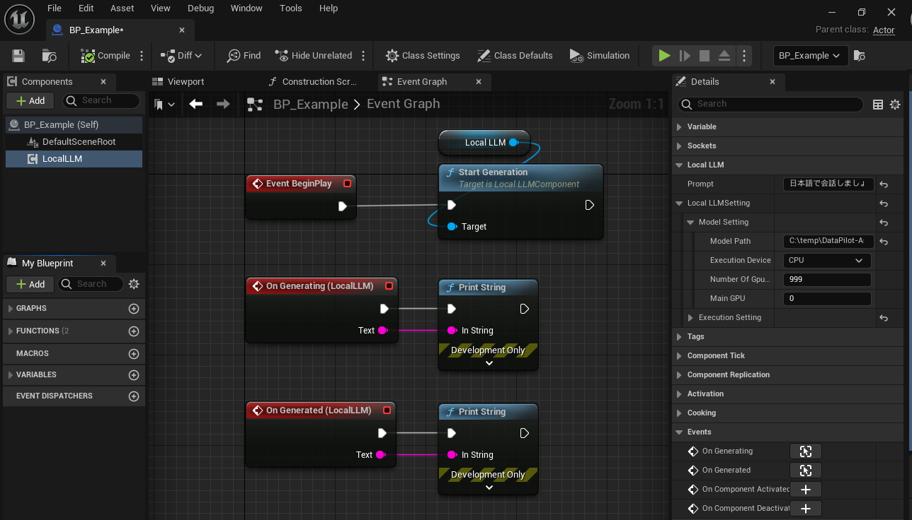

# Basic usage

See `Plugins > LocalLLM > Sample > BP > BP_Example` for a sample implementation.  
You can test it in a sample map located at `Plugins > LocalLLM > Sample > Map > Test`.

## Setup

{ loading=lazy }  

1. Create an actor blueprint.
2. Add `Local LLM` component.
3. Select `Local LLM` component and set `Local LLM > Prompt` in Details tab.
4. Select `Local LLM` component and set `Local LLM > Local LLM Setting > Model Setting` in Details tab.
	- `Model Path`: Specify the path to the gguf model.
	- `Execution device`: Whether to use CPU or GPU.
	- `Number Of Gpu Layers`: If using a GPU, specify the number of layers in the model to be run on the GPU.
	- `Main GPU`: If using a GPU and the PC is equipped with multiple GPUs, specify the index of the GPU to be used.
5. Create `On Generating` event and `On Generated` event of `Local LLM` component to get the result.
	- `On Generating` event provides intermidiate result while the model is still generating response.
	- `On Generated` event provides final result after the model finishes the response.

## Change setting

- To change setting, call `Change Setting` after changing values of `Local LLM Setting`.

	<!-- { loading=lazy }   -->

## Start and stop

- Call `Start Generation` to generate response to `Prompt`.
- Call `Stop Generation` to terminate the response to the `Prompt`.