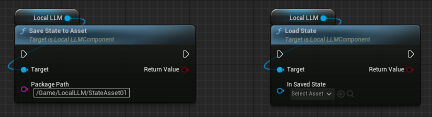
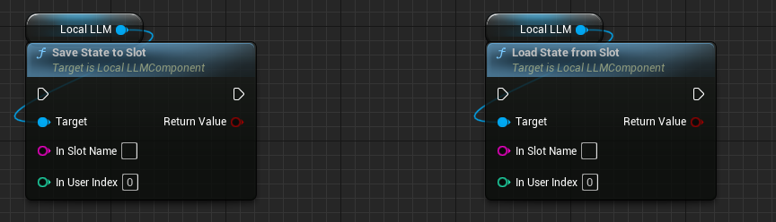
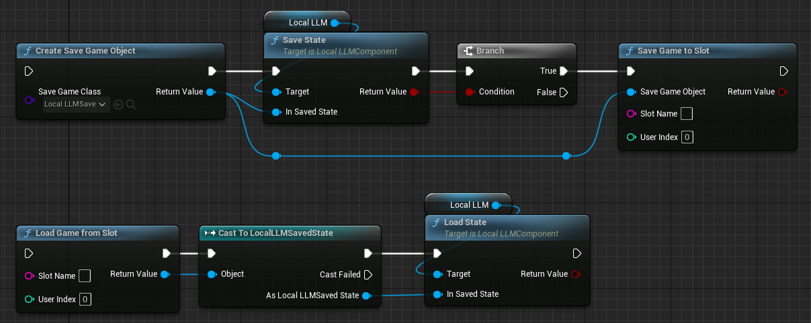

# ステートセーブとロード

現在の設定と会話履歴を保持した「ステート」のセーブとロードができます。

## アセットへの読み書き

{ loading=lazy }  

- `SaveStateToAsset`関数を呼び出すことで、指定したパスへステートのアセットをセーブします。
- `LoadState`関数を呼び出すことで、指定したアセットからステートをロードします。このとき、現在の会話履歴等は全て破棄され、ロードした設定でモデルが再度初期化され会話履歴等が設定されます。

## スロットへの読み書き

{ loading=lazy }  

通常のSave Gameと同様に、`Slot Name`と`User Index`で指定したスロットにステートをセーブできます。

- `SaveStateToSlot`関数を呼び出すことで、指定したスロットへステートをセーブします。
- `LoadStateFromSlot`関数を呼び出すことで、指定したスロットからステートをロードします。このとき、現在の会話履歴等は全て破棄され、ロードした設定でモデルが再度初期化され会話履歴等が設定されます。

??? Tip "Save Gameオブジェクトを直接触る場合"

	{ loading=lazy }  
	
	`Create Save Game Object`や`Load Game from Slot`などで`Save Game`オブジェクトを直接操作する場合は、上記のように処理を行います。ポイントとなるのは下記の二つの関数です。

	- `Save State`関数：指定した`LocalLLMSaveState`オブジェクトにステートを書き込みます。
	- `Load State`関数：指定した`LocalLLMSaveState`オブジェクトからステートを読み込みます。

## ステートから初期化

{ loading=lazy }  

保存済みのステートを使ってLLMを初期化する場合は、`Local LLM`コンポーネントを選択して詳細タブの`Local LLM > Initialization Method`で下記の設定をしておくと便利です。

- `Initialization Method = Saved State`：アセットから設定をロードして初期化する場合に使用します。`Saved State`でロードするアセットを指定します。
- `Initialization Method = Saved State from Slot`：スロットから設定をロードして初期化する場合に使用します。`Slot Name`と`User Index`でロードするスロットを指定します。

特に`Initial Prompt`と`Talk History`が長い場合、通常の方法でLLMを初期化するよりも、保存済みのステートをロードした方が早くLLMを初期化できます。
