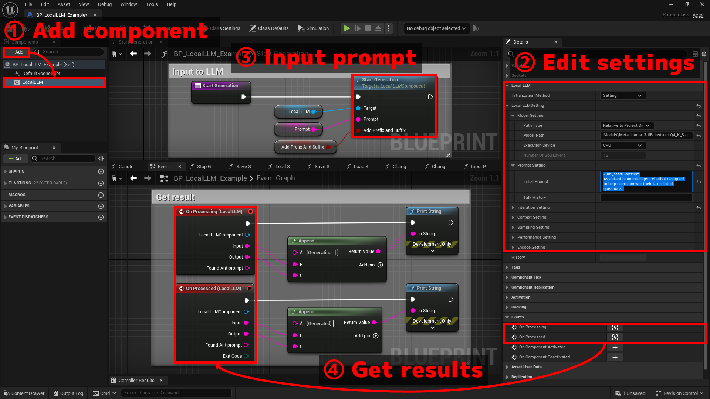

# 基本的な使い方

サンプル実装は、`Plugins > LocalLLM > BP > BP_LocalLLM_Example`にあります。  
`Plugins > LocalLLM > Map`のマップでテストできます。

{ loading=lazy }  

## 1.コンポーネントを追加

1. Actorを作成します
2. `Local LLM`コンポーネントを追加します

## 2.設定を編集

`Local LLM`コンポーネントを選択して詳細タブの`Local LLM > Local LLM Setting`で下記の設定を編集します。

1. Model Setting

	- `Path Type`：モデルのパスの種類。絶対パスで指定するかプロジェクトの相対パスで指定するか。
	- `Model Path`：使用する機械学習モデルのファイルのパスを指定します。（例：「C:\temp\model.gguf」）
	- `Execution device`： CPUとGPUのどちらを使うかを指定します。
	- `Number Of Gpu Layers`：GPUを使用する場合、GPUで実行するモデルのレイヤー数を指定します。
	<!-- - `Main GPU`：GPUを使用し、PCに複数のGPUを搭載している場合、使用するGPUの番号を指定します。 -->

2. Prompt Setting

	- `Initial Prompt`：LLMの役割や基本的な指示を記載します。  
	- `Talk History`：これまでの会話の履歴を記載します。後述する状態の保存を使わない場合に、過去の会話の続きから再開したい場合に使用します。

	これらのいずれも「LLMの初期化時に一番はじめにLLMに入力されるプロンプト」です。違いは、`Initial Prompt`は（デフォルト設定では）会話中も保持されるが、`Talk History`は会話が長くなりすぎると破棄されうることです。これは、LLMに入力できる文字列の長さ（コンテキスト長）には限りがあるためです。どのように情報を保持・破棄するかは後述の`Context Setting`で設定します。

	??? Tip "Initial Promptの例"

		ロールプレイをします。あなたは優秀なエンジニアです。あなたは「Assistant」として発言します。「User」の発言に対して、適格なアドバイスをします。アドバイスは端的に短い言葉で行ってください。会話の例を下記に示します。

		【例】  
		User: エラーになってコンパイルが通らないんだけど  
		Assistant: まずはエラーメッセージをちゃんと読みましょう。大抵のことはそれで解決します  
		User: ぜんぜん何言ってるかわかんない  
		Assistant: では、そのエラーメッセージでググりましょう。フォーラムなどで解決策が提示されているかもしれません  
		User: おけー  
		Assistant: マニュアルがある場合は、目を通しておくことも重要ですよ

		それでははじめましょう。

3. Interaction Setting

	LLMとの間で会話形式でのやりとりのためのプロンプトの加工方法を設定します。よくある設定のためのテンプレートを`Interaction Template`で選択できます。

	- `Interaction Template = Interaction of Two`: UserとAssistantの二人の会話となるように自動設定します。ユーザとAIアシスタントの名前を設定する必要があり、これらは`Prompt Setting`で会話例などを記述している場合はその内容と一致させておく必要があります。
	- `Interaction Template = Instruction`：Instruction形式に設定します。Alpacaモデル等で使用します。
	- `Interaction Template = ChatML`：ChatML形式に設定します。ChatMLの文法で訓練されたモデルで使用します。

	??? Tip "テンプレートを使用しない場合"

		`Interaction Template = None`の場合、テンプレートを使わず手動で下記の値を設定します。

		- `Antiprompts`：LLMがこのフレーズを出力した場合、出力を停止します。例えば、「User:」と設定することで、ユーザーが発言する順番になったときに生成を停止させることができます。リバースプロンプトまたはStopキーワードとも呼ばれます。
		- `Add Antiprompt as Prefix`：`Antiprompts`によらずに出力が停止した場合に、次のユーザの入力の先頭に自動的に`Antiprompts`（の配列の一番はじめのもの）を付与するかどうか。例えば、antiprompts = { "User:" } を指定し、EOSでLLMの出力が停止すると、自動的に次のプロンプトに「User:」が追加されます。
		- `Antiprompt_prefix`: bAddAntipromptAsPrefix=trueで、Antipromptによらずに出力が停止した場合にPromptに付与する「接頭辞としてのAntiprompt」に対する接頭辞。例えば、「\n」は次のプロンプトに追加される 「User:」の前に改行を追加するために使用できます。
		- `Antiprompt_suffix`: bAddAntipromptAsPrefix=trueで、Antipromptによらずに出力が停止した場合にPromptに付与する「接頭辞としてのAntiprompt」に対する接尾辞。例えば、「 」は次のプロンプトに追加される 「User:」の後にスペースを追加するために使用できます。
		- `Input Prefix`：ユーザの入力の直前に付与する文字列
		- `Input Suffix`：ユーザの入力の直後に付与する文字列。これは、ユーザーの入力の後に 「Assistant:」 のようなプロンプトを追加するのに便利です。ユーザーの入力の最後に自動的に追加される改行文字(\n)の後に追加されます
		
4. Context Setting

	- `N Ctx`：テキスト生成時にモデルが使用するコンテキスト長（トークン数）。これを大きくすると、長い入力や長い会話に対する応答が可能になります。
	- `N Keep`：モデルへの入出力の合計がコンテキスト長を上回った際に、`Initial Prompt`のうちいくつのトークンを保持するか。-1の場合は`Initial Prompt`のすべてのトークンを保持します。ただし、この値が(`N Ctx` - 64)を超える場合は、(`N Ctx` - 64)に自動的に設定されます。
	- `N Predict`：入力1回に対して生成するトークンの最大数 (-1 = 制限なし、-2 = コンテキストが埋まるまで)

	??? Tip "トークン破棄の規則"

		例えば、`N Ctx = 512`、`N Keep = -1`、`N Predict = -1`で、`Initial Prompt`が300トークンであった場合、512 - 300 = 212 トークンの中で会話をしていくことになります。ユーザからの入力とLLMの出力のそれぞれでこの212トークンを消費していき、残りが32トークン以下となったところで過去の入出力の一部が破棄されます。

		破棄されるトークン数は下記のパラメータで設定します。

		- `Discard Rule = Fixed Ratio`の場合： (現在までに使用したトークン数 - `N Keep`) * `Ratio` だけ破棄します。
		- `Discard Rule = Fixed Length`の場合： `Length` で指定した数だけ破棄します。

5. Sampling Setting

	生成されるテキストの多様性、創造性、品質をニーズに応じて微調整するための設定。
	
	詳細は各項目のツールチップまたは`LocalLLMStruct.h`のコメントをご覧ください。

6. Performance Setting

	LLMモデルのパフォーマンスとメモリ使用量を改善するための設定
	
	詳細は各項目のツールチップまたは`LocalLLMStruct.h`のコメントをご覧ください。

7. Encode Setting

	LLMに入力するプロンプトで改行などを扱うための変換処理の設定。

	詳細は各項目のツールチップまたは`LocalLLMStruct.h`のコメントをご覧ください。

## 3.テキスト生成の開始

プロンプトと呼ばれる文字列を入力し、LLMにテキストの生成開始を指示する処理を作成します。  
具体的には、`Start Generation`関数を呼び出します。

- テキストの生成自体は非同期に実行されます。生成結果の取得方法は「4.結果の取得」をご覧ください。
- テキスト生成中でもいつでも`Start Generation`関数を呼び出し、新たなプロンプトを入力することができます。

## 4.結果の取得

`Local LLM`コンポーネントの下記イベントから結果を取得する処理を作成します。

- `On Processing` イベントは、モデルが回答中の、中間的な結果を提供します。
- `On Processed` イベントは、モデルの回答が完了した後に、最終的な結果を提供します。

それぞれ、下記の結果が渡されます。

- `Input`: ユーザの入力にPrefixとSuffixを追加した、実際にLLMが処理した入力文字列
- `Output`: LLMからの出力文字列
- `Found Antiprompt`: LLMからの出力文字列の末尾にAntipromptが見つかった場合はその文字列。見つからなかった場合は空。
- `Exit Code` (On Processedのみ): テキスト生成が停止した理由。

## その他

- 実行時に設定を変更するには、`Change Setting`関数を呼び出します。現在の会話履歴等は全て破棄され、新たな設定でモデルの初期化が行われます。
- `Stop Generation`関数を呼び出すと、プロンプトに対する回答を途中で強制終了できます。
- `Hisotry`変数に、実際にLLMが処理した入出力が書き出されます。