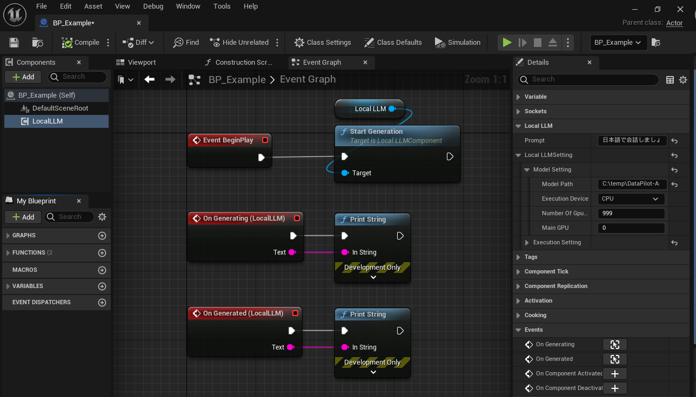

# 基本的な使い方

サンプル実装は、`Plugins > LocalLLM > Sample > BP > BP_Example`にあります。  
`Plugins > LocalLLM > Sample > Map > Test`のマップでテストできます。

## セットアップ

{ loading=lazy }  

1. アクターBlueprintを作成します
2. `Local LLM`コンポーネントを追加します
3. `Local LLM`コンポーネントを選択して詳細タブで`Local LLM > Prompt`にプロンプトを設定します。
4. `Local LLM`コンポーネントを選択して詳細タブで`Local LLM > Local LLM Setting > Model Setting`の値を設定します:
	- `Model Path`：使用する機械学習モデルのファイルのフルパスを指定します。
	- `Execution device`： CPUとGPUのどちらを使うかを指定します。
	- `Number Of Gpu Layers`：GPUを使用する場合、GPUで実行するモデルのレイヤー数を指定します。
	- `Main GPU`：GPUを使用し、PCに複数のGPUを搭載している場合、使用するGPUの番号を指定します。

5. `Local LLM`コンポーネントの`On Generating`イベントと`On Generated`イベントから結果を取得する処理を作成します。
	- `On Generating` イベントは、モデルが回答中の、中間的な結果を提供します。
	- `On Generated` イベントは、モデルの回答が完了した後に、最終的な結果を提供します。

## 設定の変更

- 設定を変更するには、`Change Setting`関数を呼び出します。

	<!-- { loading=lazy }   -->

## 実行と停止

- `Start Generation`関数を呼び出し、プロンプトに対する回答を生成します。
- `Stop Generation`関数を呼び出すと、プロンプトに対する回答を途中で強制終了できます。